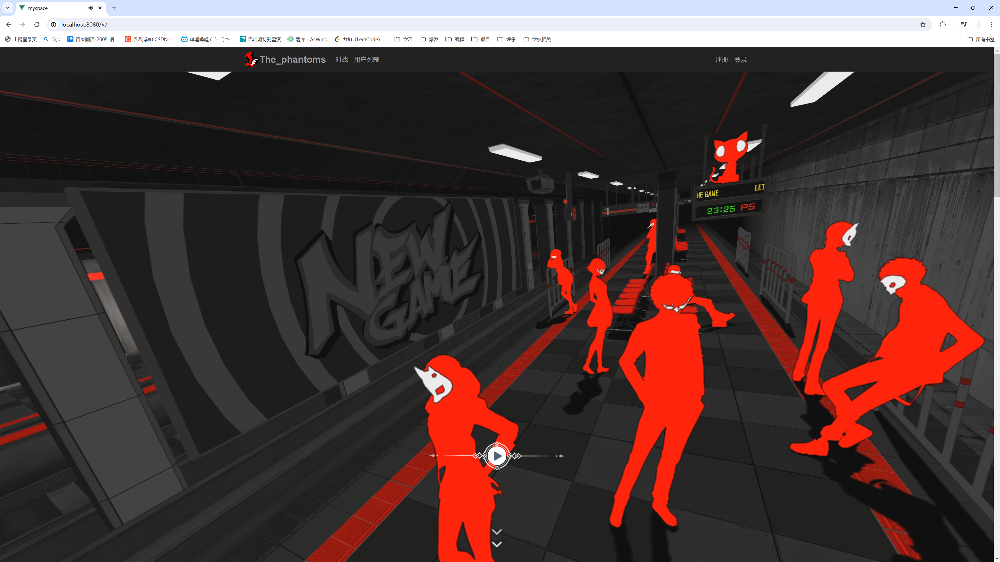
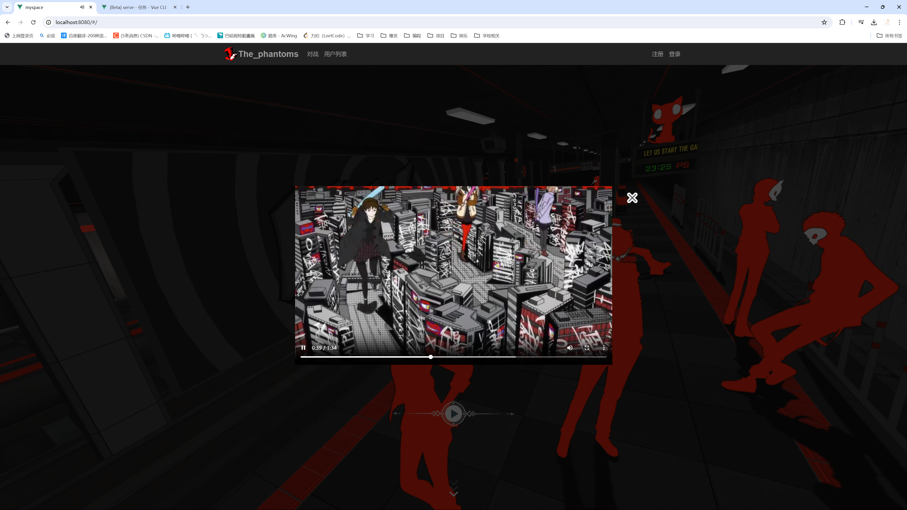
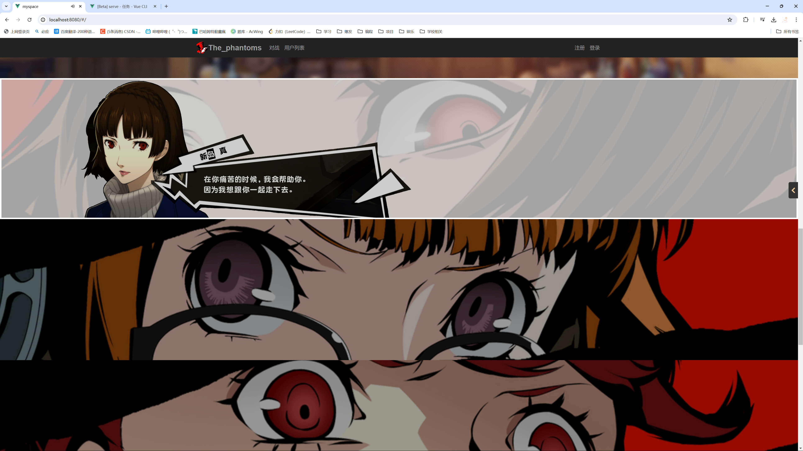
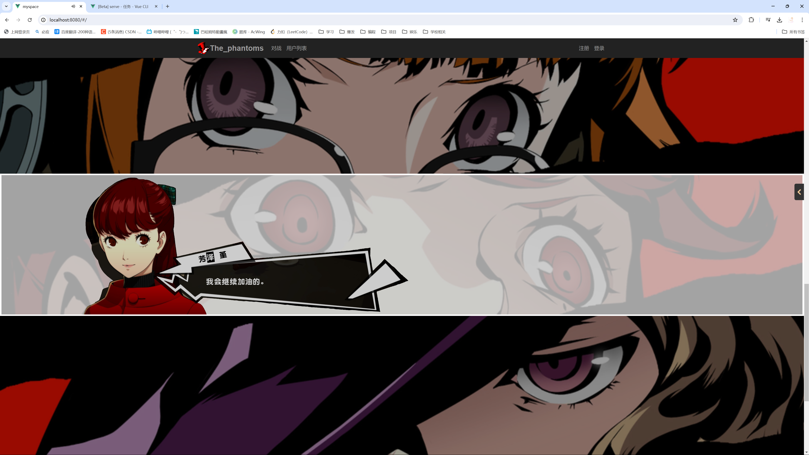
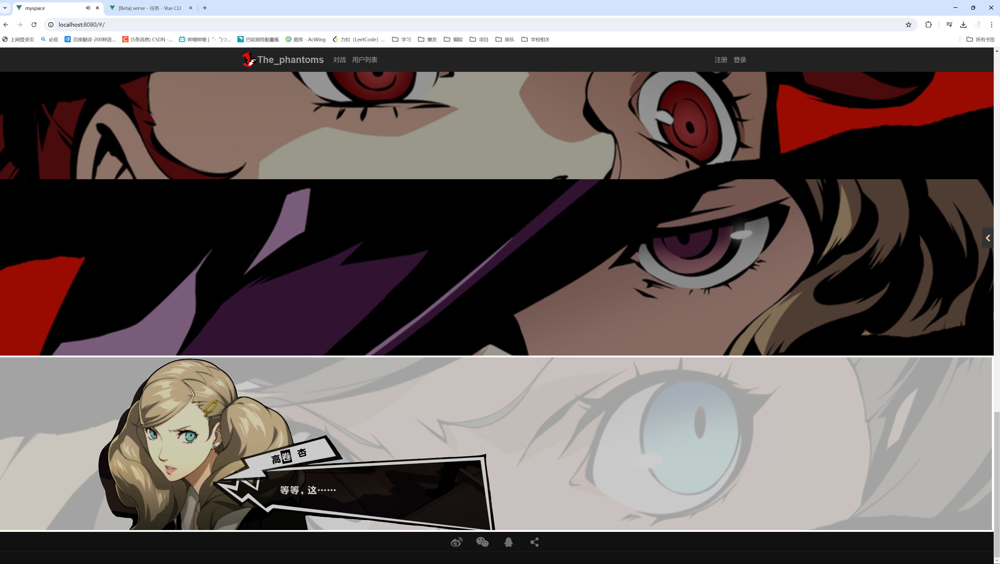
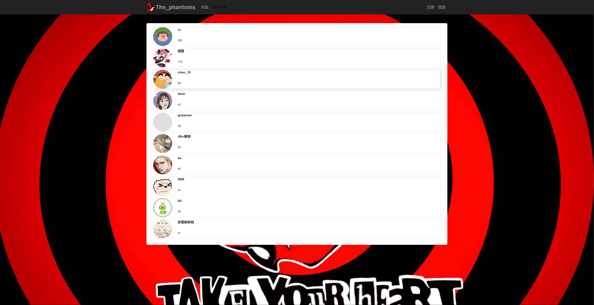
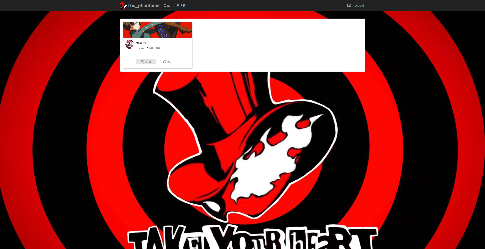
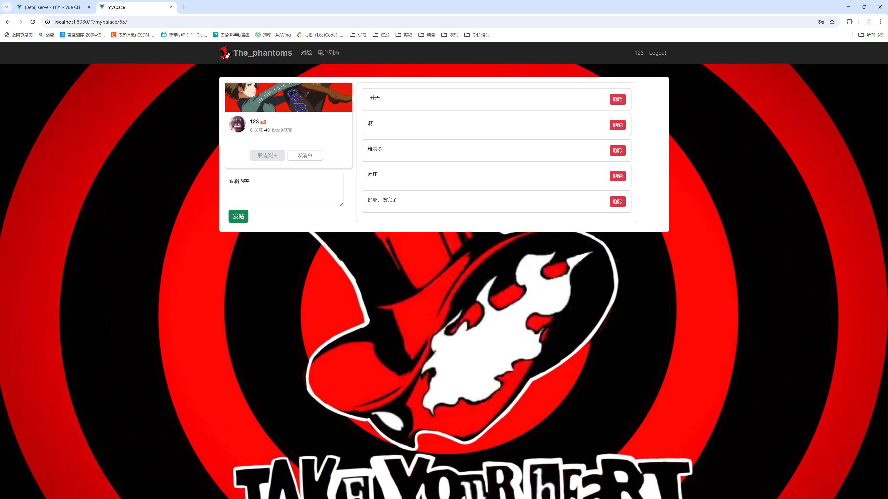
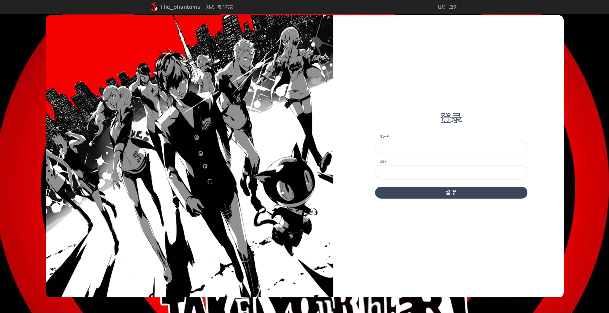
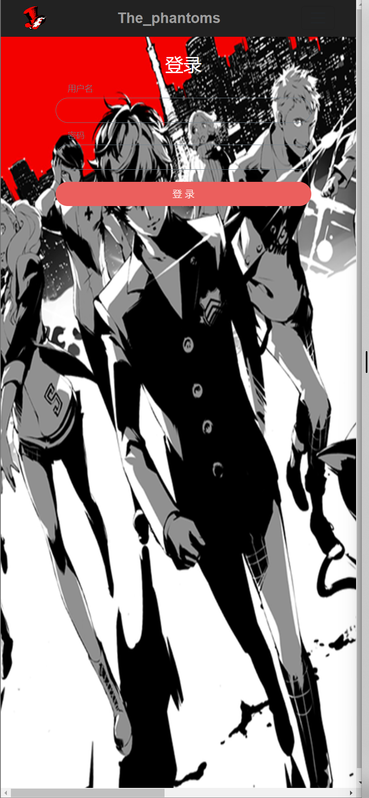

[Vue 官网](https://vuejs.org/)

**终端**

`Linux`和`Mac`上可以用自带的终端。

`Windows`上推荐用`powershell`或者`cmd`。`Git Bash`有些指令不兼容。

**安装`Nodejs`**

[安装地址](https://nodejs.org/en/)

**安装`@vue/cli`**

打开`Git Bash`，执行：

```bash
npm i -g @vue/cli
```

如果执行后面的操作有 bug，可能是最新版有问题，可以尝试安装早期版本，比如：`npm i -g @vue/cli@4`

**启动`vue`自带的图形化项目管理界面**

```bash
vue ui
```

常见问题 1：Windows 上运行`vue`，提示无法加载文件，表示用户权限不足。

解决方案：用管理员身份打开终端，输入`set-ExecutionPolicy RemoteSigned`，然后输入`y`

安装插件有:

1. @vue/cli-service(5.0.8)
2. @vue/cli-plugin-babel(5.0.8)
3. @vue/cli-plugin-eslint(5.0.8)
4. @vue/cli-plugin-router(5.0.8)
5. @vue/cli-plugin-vuex(5.0.8)

安装依赖有：

1. @popperjs/core(2.11.8)
2. axios(1.7.2)
3. bootstrap(5.3.3)
4. core-js(3.37.1)
5. gif.js(0.2.0)
6. jquery(3.7.1)
7. jwt-decode(4.0.0)
8. vue(3.4.32)
9. vue-router(4.4.0)
10. vuex(4.1.0)

进入 serve 运行

# 网站完成介绍

## 首页



1. 进入网站是 p5 剪影图做海报
2. 主页自动播放背景音乐(Take Over it)
3. 网页正中间有播放按钮，点击播放按钮后会弹出 op

   
   当播放视频时，整个页面是被禁止滚动的，只能操作视频，此时背景音乐将被禁用掉

4. 当首页向下滑动一个窗口距离后将会出现右侧的卡片，可以点击箭头使其收回
   

5. poster 下面的区域为新闻区，通过 banner 和对应的文字说明板块构成，banner 的图片每隔 5 秒更换

6. 下方的暴击横条可是设置跳转链接，当鼠标放上之后的 hover 状况下会有特殊动画，和人物出现效果
   
   
   

## 对战页面

传统格斗游戏，目前没有实现匹配功能
这有移动，跳跃，攻击功能，全部有 JavaScript 类继承实现，好扩展
自动播放背景音乐 Life Will Change
没有 p5 素材，自己肝太多了，只能先用拳皇的了


## 用户列表页面

返回服务器上注册的前十位用户，对接的 acapp 的 api

点击用户图像，如果未登录会跳转到登录页面，登录后才能跳转到对应用户的页面，可以查看对应用户的发帖和信息，存在服务器中


## 个人中心页面

在这个页面可以发帖和删除帖子，上传到服务器，别人可以看见，别人和自己公用一个模板，只有自己进入自己页面时才能发帖和删帖


## 登录和注册页面

采用相应是布局，当页面宽度超过 768px 时，是


当页面宽度低于 768px 时是

<div style="text-align: center;">

</div>

登录成功会跳转到首页，登录失败会有错误提示信息，
注册页面同理，注册成功会跳转登录页面，失败会有提示信息
